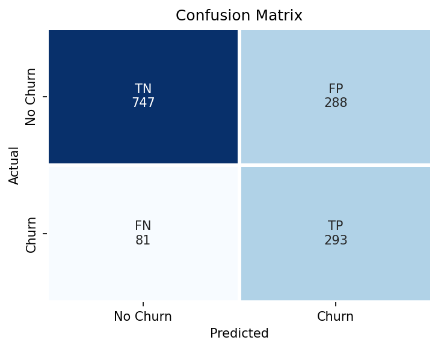
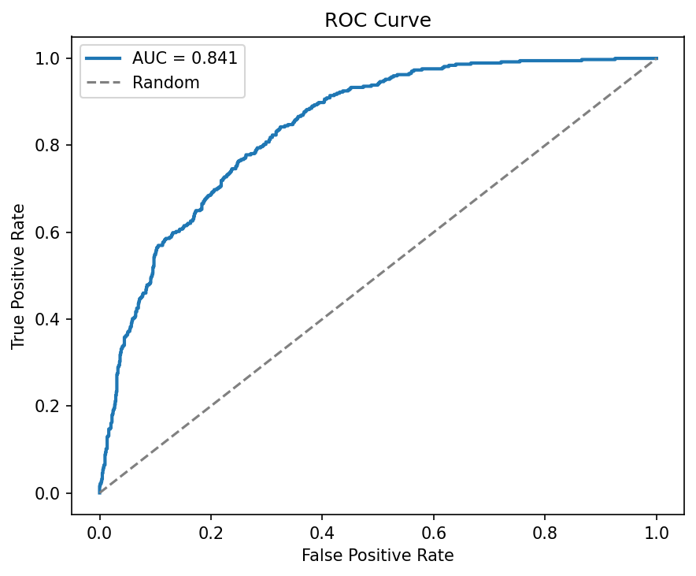
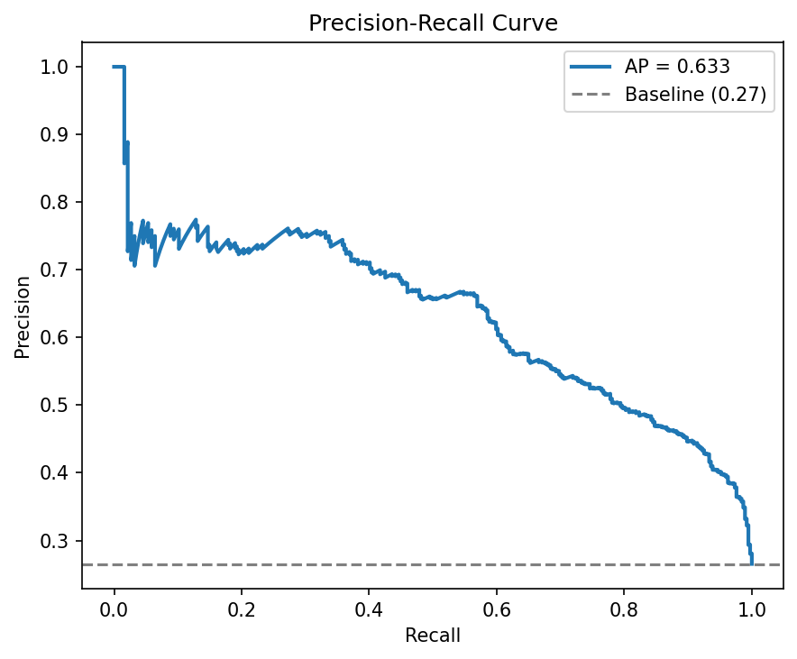
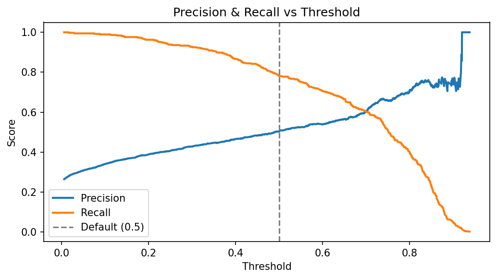

# Churn Predictor - Customer Churn Prediction 

A production-ready ML pipeline for predicting customer churn using the Telco Customer Churn dataset. 

## Problem 

Predict whether a customer will churn (cancel subscription) based on their account and data usage. 

## Dataset
- Source: [IBM Telco Customer Churn](https://www.kaggle.com/datasets/blastchar/telco-customer-churn)
- 7043 customers, 20 features, binary target (Churn: Yes/No)
- Class distribution: 73% No Churn, 27% Churn (imbalanced)

## Logistic Regression Report 

----- CV RESULTS --------
| metric     | mean   | std    |
|------------|--------|--------|
| precision  | 0.5165 | 0.0189 |
| f1         | 0.6279 | 0.0232 |
| roc_auc    | 0.8459 | 0.0124 |

---- Test Metrics -----
| metric     | value  |
|------------|--------|
| accuracy   | 0.7381 |
| precision  | 0.5043 |
| recall     | 0.7834 |
| f1         | 0.6136 |
| roc_auc    | 0.8413 |

---- Confusion Matrix -----
| TN  | FP  |
|-----|-----|
| 747 | 288 |
| FN  | TP  |
| 81  | 293 |

---- Classification report -----
| class     | precision | recall | f1-score | support |
|-----------|-----------|--------|----------|---------|
| No Churn  | 0.90      | 0.72   | 0.80     | 1035    |
| Churn     | 0.50      | 0.78   | 0.61     | 374     |
| accuracy  |           |        | 0.74     | 1409    |
| macro avg | 0.70      | 0.75   | 0.71     | 1409    |
| weighted avg | 0.80   | 0.74   | 0.75     | 1409    |

## Model Visualizations

**Confusion Matrix**  

**ROC Curve**  

**Precision-Recall Curve**  

**Threshold Analysis**  

## Key Insights

- Model achieves **ROC-AUC ~0.84**, indicating strong ranking ability
- Recall for churn class is **0.78 → good at catching churners**
- Precision is **0.50 → moderate false positives**
- Model favors **recall over precision (business-oriented choice)**

## Business Interpretation

- The model is suitable for **retention campaigns**
- It prioritizes identifying churners even at the cost of false alarms
- This tradeoff is common in churn prediction problems

---

[byGanesh.com](https://byGanesh.com)  
MIT LICENSE
